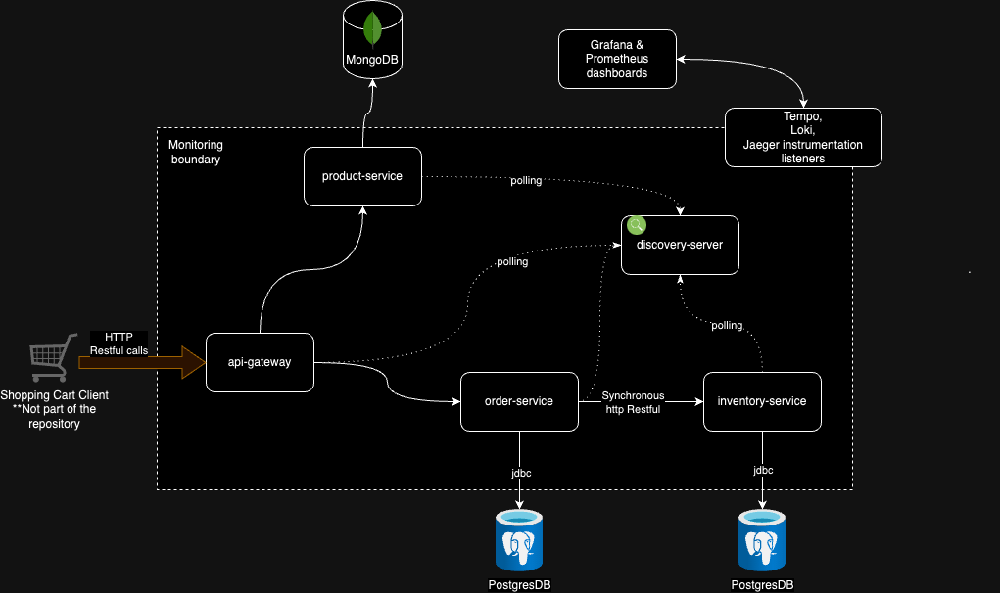

# README.md file for spring microservices project

Welcome to the spring-boot-microservices with Springboot v3

## Overview

This repository explores the features of Springboot to build intercommunicating microservices with modern springboot v3 features such as

1. Micrometer for observability
2. Spring cloud api gateway server
3. Netflix Eureka server for service discovery
4. Full portability with docker containerization 
5. Springboot webflux webclient for retriable non-blocking API calls

Apart from these modern features it touches upon various other commonly implemented Springboot supported features viz.

1. Spring data rest
2. Spring data JPA
3. spring data mongodb
4. springboot actuator
5. Testcontainers for unit testing

## Component Diagram

The diagram below self-explanatory and represents the high level components which are created by this project



## Quickstart

The simplest way to run the project is to run the `docker-compose.yml` file in the root directory. This docker compose file consists all the individual servers needed to run the entire application components , which includes the following list of server components

IMPORTANT : If tyou are running project in local and try to update the docker images in the repo then please take the following steps :
1. Make sure that root pom.xml has correct user listed in the docker hub registry url e.g. 
2. Go to the root directory and execute the following command to compile, build and upload new images to the docker registry publicly.
```bash
./mvnw clean compile jib:build -d 
```

**#Data stores**
mongo-products => image: mongo:4.0.28-xenial
postgres-inventory => image: postgres:latest
postgres-orders => image: postgres:latest

**#Oberservability containers**
tempo => image: grafana/tempo
loki => image: grafana/loki
prometheus => prom/prometheus
grafana => grafana/grafana

**#Spring boot Service Containers**

discovery-server => image: technolearn/discovery-server:latest
api-gateway => image: technolearn/api-gateway:latest
product-service image: technolearn/product-service:latest
order-service => image: technolearn/order-service:latest
inventory-service => image: technolearn/inventory-service:latest

```bash
docker compose up -d #Because the file name is docker-compose.yml, you do not have to provide filename
```

<aside>
💡 Please note that the project can be run locally as well using spring boot runner and creating containers just for the data stores and observability servers through docker-compose. to do so please run the following command in the root directory and then individually start the desired application through Springboot runner of your favourite IDE

`docker compose up -f docker-compose-local.yml -d`

</aside>

## Quick Access Links Upon Startup

Once the application is up and running after executing the `docker compose up -d` command(Running all the spring boot services in their own containers) we can acces the links given below. 

<aside>
💡 Please note that no authentication is implemented for any of the endpoints. This the links below are directly accessible locally.

</aside>

1. Eureka Server UI client : http://localhost:8181/eureka/web    
2. API Gateway endpoint to make other service calls : http://localhost:8181/api/*
    1. product-service : http://localhost:8181/api/products
    2. inventory-service : http://localhost:8181/api/inventory
    3. orders-service : http://localhost:8181/api/orders
3. Prometheus dashboard: [http://localhost:9090/](http://localhost:9090/)
4. Grafana dashboard: [http://localhost:3000/](http://localhost:3000/)
    

## Testing

Currently only 3 out of 5 maven modules have integration tests viz. product-service, inventory-service & order-service. The remaining two viz. api-gateway & discovery server have no code and only the configurations, thus no tests have been added for those modules.

Currently the three services module feature integration testing where the Junit is leveraging TestConatiners library to mimic the running data stores(Mongo & Postgres). In these integration tests we make mock http calls to the controller methods through which delegation happens all the way to the data layer and back. This allows approximately 91% code overage for the services. Please note that order-service initiates the inter service communication calls with the inventory service to check the inventory before placing the order. The mock behaviour of the API call is to be committed soon.

To run the junit tests, open a terminal and go to the root directory `spring-boot-microservices-boot` and make use of the maven wrapper to run the maven test target as given below.

```bash
./mvnw clean test
```

**Testing using Postman Tool**

The postman collection has been pushed to the repository in folder `./postman-collection` ,which can be imported in the tool to make calls to the APIs. The Postman has example request and responses captured.

## TODOs

1. Adding baggage fields for distributed traceability 
2. Adding tests with mock API calls for inter service connectivity
3. Defining common business exceptions and handers for all the services

## References

1. Spring project initializer 
    
    [https://start.spring.io/](https://start.spring.io/)
    
2. Docker hub for container image download and upload
    
    [https://hub.docker.com/](https://hub.docker.com/)
    
3. Spring cloud microservices tutorial
    
    [https://www.youtube.com/watch?v=mPPhcU7oWDU&list=PLSVW22jAG8pBnhAdq9S8BpLnZ0_jVBj0c&index=11](https://www.youtube.com/watch?v=mPPhcU7oWDU&list=PLSVW22jAG8pBnhAdq9S8BpLnZ0_jVBj0c&index=11)
    
4. Spring Observability using SpringBoot version 3.X.X toturial
    
    [https://spring.io/blog/2022/10/12/observability-with-spring-boot-3](https://spring.io/blog/2022/10/12/observability-with-spring-boot-3)
    
5. Portable container testing using TestContainers
    
    [https://testcontainers.com/guides/getting-started-with-testcontainers-for-java/](https://testcontainers.com/guides/getting-started-with-testcontainers-for-java/)